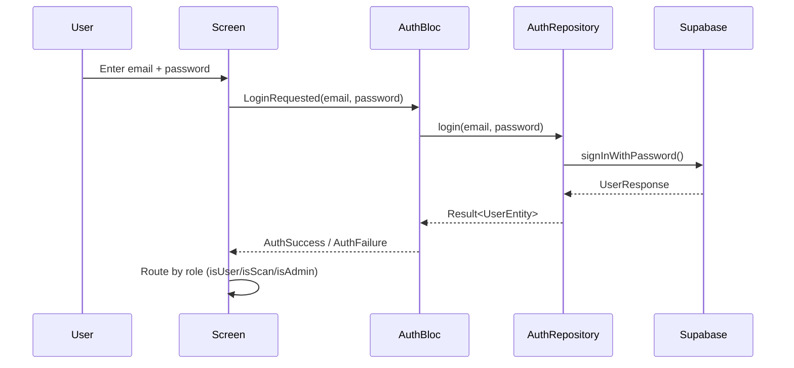
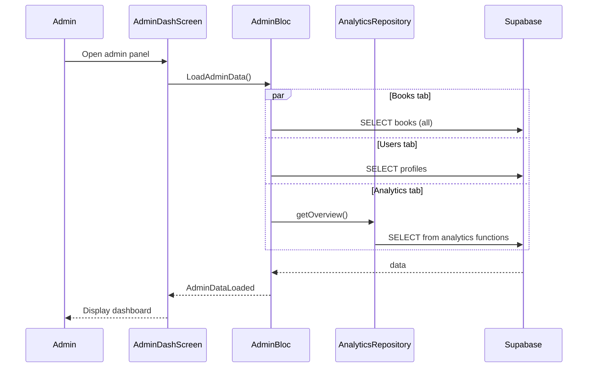
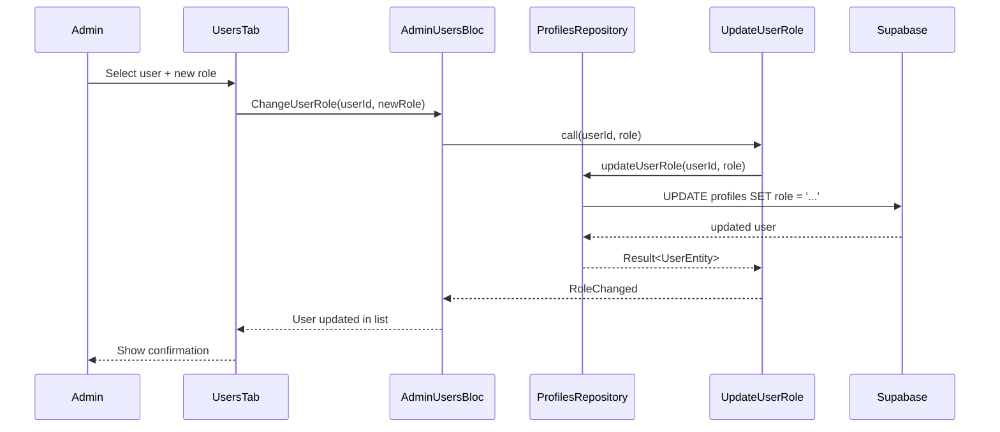

# Administrador (`role = 'admin'`) — Auditoría Completa

> **Fecha de auditoría**: 2026-07-19
> **Proyecto**: Noveles (Flutter + Supabase)
> **Roles en sistema**: `user`, `scan`, `admin`, `suspended`

---

## 1. Definición y Modelo

### 1.1 UserEntity (`lib/features/profiles/domain/user_entity.dart`)

```dart
class UserEntity extends Equatable {
  final String id;
  final String email;
  final UserRole role;   // UserRole enum: user, scan, admin, suspended
  final String? displayName;
  final String? bio;
  final String? avatarUrl;

  bool get isScan => role == UserRole.scan;         // Línea 21
  bool get isAdmin => role == UserRole.admin;       // Línea 22
  bool get isUser => role == UserRole.user;         // Línea 23
  bool get isSuspended => role == UserRole.suspended; // Línea 24
}
```text

- `isAdmin` es un **getter simple** que compara `role == UserRole.admin`
- Los roles se definen en el enum `UserRole`
(`lib/features/profiles/domain/user_role.dart`)
- `copyWith` permite cambiar cualquier campo incluyendo `role`

### 1.2 UserModel (`lib/features/profiles/data/user_model.dart`)

```dart
factory UserModel.fromJson(Map<String, dynamic> json) => UserModel(
  role: UserRole.fromString(json['role'] as String?),  // Default: UserRole.user
);
```text

- El **default** del rol es `UserRole.user` — si no hay `role` en el JSON, el
usuario
  es `user`
- Serializa/deserializa con `toJson()` / `fromJson()`
- Mapea `display_name` ↔ `displayName`, `avatar_url` ↔ `avatarUrl`

### 1.3 Historial de Migración del Rol

| Migración | Fecha | Cambio |
| ----------- | ------- | -------- |
| `admin_roles.sql` | 15 Mayo | Agrega columna `is_admin` a profiles |
| fix_admin_consolidation.sql | 15 Mayo | Elimina is_admin — pasa a usar role |
| fix_profiles_rls_recursion.sql | 17 Mayo | Crea is_admin() SECURITY DEFINER |
| rename_admin_to_scan.sql | 20 Mayo | Renombra admin→scan, crea is_scan() |
| `add_admin_role.sql` | 20 Mayo | Re-introduce rol admin, crea `is_admin()` |
| add_suspended_role.sql | 20 Jul | Agrega rol suspended, crea is_suspended() |

---

## 2. Flujo de Autenticación

### 2.1 AuthBloc (`lib/features/auth/presentation/bloc/auth_bloc.dart`)

El `AuthBloc` maneja login, registro, logout y verificación de sesión. **No
distingue roles** — simplemente emite `AuthAuthenticated(user)` con el
`UserEntity` completo.

#### Diagrama de Secuencia — Flujo de Login



### 2.2 Enrutamiento por Rol (`lib/core/app/app.dart`, líneas 54-62)

```dart
if (authState is AuthAuthenticated) {
  if (authState.user.isAdmin) {
    return const AdminDashScreen();    // ← ADMIN va directo al dashboard
  }
  if (authState.user.isScan) {
    return const ScanMainScreen();     // ← SCAN va a su pantalla
  }
  return const MainScreen();           // ← USER va a la pantalla normal
}
```text

**Flujo admin**: Login → `AuthAuthenticated` → `isAdmin == true` →
`AdminDashScreen`

**No hay pantalla de bienvenida, onboarding, ni selección.** El admin es
redirigido automáticamente.

### 2.3 Ruta `/admin`

También registrada como ruta nombrada en `app.dart` línea 33:

```dart
routes: {
  '/admin': (_) => const AdminDashScreen(),
}
```text

---

## 3. Pantallas y Navegación

### 3.1 AdminDashScreen
(`lib/features/admin/presentation/screens/admin_dash_screen.dart`)

Pantalla principal del admin. Usa `IndexedStack` con **4 tabs**:

| Tab Index | Widget | Label | Icono |
| ----------- | -------- | ------- | ------- |
| 0 | `BooksTab` | Libros | `Icons.library_books` |
| 1 | `GenresTab` | Géneros | `Icons.category` |
| 2 | `UsersTab` | Usuarios | `Icons.people` |
| 3 | `AnalyticsTab` | Analíticas | `Icons.analytics` |

**BLoCs providers** (líneas 28-35):

- `AdminBloc` — se crea al montar, dispara `LoadAdminBooks()` inmediatamente
- `AdminUsersBloc` — se crea al montar, dispara `LoadAdminUsers()`
  inmediatamente

**Drawer**: `AppDrawer(isAdmin: true)` — muestra "Panel Admin" como primer
item.

### 3.2 AppDrawer (`lib/features/app/presentation/widgets/app_drawer.dart`)

El drawer acepta `isScan` y `isAdmin` como parámetros:

- **Si `isAdmin == true`** (línea 58-65): Muestra "Panel Admin" con icono
  `Icons.admin_panel_settings` → navega a `/admin`
- **Si `isAdmin == false`** (línea 67-72): Muestra "Inicio" (user) o "Panel
  Scan" (scan)
- **Común a todos**: "Editar Perfil" → `ProfileScreen`, "Cerrar Sesión"

**Nota**: El drawer NO oculta el "Panel Admin" para usuarios regulares —
simplemente no se muestra porque `isAdmin` es `false`.

### 3.3 Ruta a Label Management

Desde `BooksTab` (línea 83-86), el admin puede acceder a `/label-management`:

```dart
onPressed: () => Navigator.pushNamed(context, '/label-management'),
```text

---

## 4. Dashboard Admin — Detalle por Tab

### 4.1 Tab: Libros (`lib/features/admin/presentation/screens/books_tab.dart`)

#### Diagrama de Secuencia — Carga del Dashboard Admin



**Resumen superior** (líneas 52-78):

- Card con estadísticas: "Visibles: X" y "Total: Y"
- Calcula `visible` filtrando `books.where((b) => b.isVisible)`

**Botón de Etiquetas** (líneas 80-90):

- Navega a `/label-management` (gestión de labels)

**Lista de libros** (líneas 92-196):

- Cada libro muestra: portada, nombre, autor, estado visible/oculto
- **Acciones por libro**:
  - **Toggle visibilidad** (ícono eye): `ToggleBookVisibility(book.id,
    !book.isVisible)` — publica u oculta
  - **Eliminar** (ícono delete rojo): Abre dialog de confirmación →
    `DeleteAdminBook(bookId)`
- Pull-to-refresh recarga la lista

**Estados del AdminBloc**:

- `AdminInitial` / `AdminLoading` → CircularProgressIndicator
- `AdminLoaded` → Lista de libros
- `AdminError` → Mensaje de error + botón reintentar

### 4.2 Tab: Géneros

(`lib/features/admin/presentation/screens/genres_tab.dart`)

**BLoC propio**: Crea su propia instancia de `GenreBloc` (no usa el del padre).

**CRUD completo**:

- **Crear**: FAB (`FloatingActionButton`) → dialog con campo de nombre →
  `CreateGenreEvent`
- **Editar**: Icono de lápiz por género → dialog pre-llenado →
  `UpdateGenreEvent`
- **Eliminar**: Icono de basura → dialog de confirmación → `DeleteGenreEvent`
- **Listar**: ListView.builder con todos los géneros

### 4.3 Tab: Usuarios

(`lib/features/admin/presentation/screens/users_tab.dart`)

**Solo lectura actualmente**— NO permite cambiar roles ni eliminar
usuarios.**Pantalla**:

- Lista de todos los usuarios con `ListView.builder`
- Cada usuario muestra:
  - `CircleAvatar` con fondo primario si es admin, secundario si no
  - Primera letra del nombre/email
  - Nombre display (o email como fallback)
  - Email
  - `RoleBadge` con el rol

**RoleBadge widget** (líneas 70-97):

- Si `role == 'admin'`: fondo `primaryContainer`, texto "Admin"
- Si no: fondo `surfaceContainerHighest`, texto del rol tal cual

### 4.4 Tab: Analíticas

(`lib/features/admin/presentation/screens/analytics_tab.dart`)

**Stub / Placeholder** — Solo muestra un card con:

- Icono `Icons.analytics_outlined`
- Título "Analíticas"
- Texto "Próximamente"

## NO hay funcionalidad real de analytics implementada

---

## 5. Gestión de Usuarios (Solo Admin)

### 5.1 AdminUsersBloc

(`lib/features/admin/presentation/bloc/admin_users_bloc.dart`)

#### Diagrama de Secuencia — Cambio de Rol de Usuario



```dart
class AdminUsersBloc extends Bloc<AdminUsersEvent, AdminUsersState> {
  final GetAllProfiles getAllProfiles;
  final UpdateUserRole updateUserRole;
  final String currentUserId;

  AdminUsersBloc({
    required this.getAllProfiles,
    required this.updateUserRole,
    required this.currentUserId,
  }) : super(const AdminUsersInitial()) {
    on<LoadAdminUsers>(_onLoadUsers);
    on<ChangeUserRole>(_onChangeRole);
    on<SuspendUser>(_onSuspendUser);
  }
}
```text

**Nota**: `AdminUsersBloc` NO está registrado en `injection_admin.dart`. Se
crea directamente en `AdminDashScreen` (L40-44) con dependencias obtenidas
de `getIt`.

**Evento único**: `LoadAdminUsers` → llama `getAllProfiles()` → emite
`AdminUsersLoaded(users)`

### 5.2 AdminUsersEvent
(`lib/features/admin/presentation/bloc/admin_users_event.dart`)

3 eventos:

```dart
class LoadAdminUsers extends AdminUsersEvent {
  const LoadAdminUsers();
}

class ChangeUserRole extends AdminUsersEvent {
  final String targetUserId;
  final String newRole;
  const ChangeUserRole({required this.targetUserId, required this.newRole});
}

class SuspendUser extends AdminUsersEvent {
  final String targetUserId;
  const SuspendUser({required this.targetUserId});
}
```text

### 5.3 AdminUsersState
(`lib/features/admin/presentation/bloc/admin_users_state.dart`)

```dart
class AdminUsersLoaded extends AdminUsersState {
  final List<UserEntity> users;
  final String? message;
}
```text

### 5.4 GetAllProfiles Use Case
(`lib/features/profiles/domain/get_all_profiles.dart`)

```dart
class GetAllProfiles {
  final ProfilesRepository repository;
  Future<Result<List<UserEntity>>> call() async {
    return repository.getAllProfiles();
  }
}
```text

### 5.5 ProfilesRepositoryImpl.getAllProfiles

`lib/features/profiles/data/profiles_repository_impl.dart`, línea 74-83

```dart
Future<Result<List<UserEntity>>> getAllProfiles() async {
  final response = await _supabase.client
      .from('profiles')
      .select('*')
      .order('email')
      .limit(100);
  // ...
}
```text

**Limitaciones**:

- Hardcoded a 100 usuarios máximo
- Sin paginación
- Ordenado por email

### 5.6 Brechas Críticas en Gestión de Usuarios

| Capacidad | Estado | Notas |
| ----------- | -------- | ------- |
| Listar usuarios | ✅ Funcional | Hasta 100, sin paginación |
| Ver roles | ✅ Funcional | Badge muestra rol |
| Cambiar rol | ✅ Funcional | ChangeUserRole evento,UpdateUserRole use case |
| Eliminar usuario | ❌ No implementado | No hay UI ni eventos |
| Suspender usuario | ✅ Funcional | SuspendUser, usa `UserRole.suspended` |
| Buscar usuario | ❌ No implementado | Sin filtro de búsqueda |

---

## 6. Gestión de Libros

### 6.1 AdminBloc (`lib/features/admin/presentation/bloc/admin_bloc.dart`)

```dart
class AdminBloc extends Bloc<AdminEvent, AdminState> {
  final GetBooks getBooks;
  final ToggleBookVisibility toggleBookVisibility;
  final DeleteBook deleteBook;
}
```text

**Eventos** (`admin_event.dart`):

| Evento | Campos | Descripción |
| -------- | -------- | ------------- |
| `LoadAdminBooks` | — | Carga todos los libros (incluye no visibles) |
| `ToggleBookVisibility` | `bookId`, `isVisible` | Publica u oculta un libro |
| `DeleteAdminBook` | `bookId` | Elimina un libro permanentemente |

**Estados** (`admin_state.dart`):

| Estado | Campos | Descripción |
| -------- | -------- | ------------- |
| `AdminInitial` | — | Estado inicial |
| `AdminLoading` | — | Cargando |
| AdminLoaded | `books, message?` | Lista con mensaje opcional |
| `AdminError` | `message: String` | Error con mensaje |

**Nota importante**: `GetBooks` se llama **sin** `onlyVisible: true`, lo que
significa que el admin ve **TODOS** los libros incluyendo los ocultos. Esto es
intencional — el admin necesita gestionar visibilidad.

### 6.2 Flujo de Toggle Visibilidad

```text
User tap eye icon → ToggleBookVisibility(bookId, !currentVisible)
  → BookRepositoryImpl.toggleBookVisibility()
    → Supabase: UPDATE books SET is_visible = isVisible WHERE id = bookId
  → AdminBloc actualiza estado optimísticamente (map sobre lista)
  → Muestra SnackBar: "Libro publicado" o "Libro ocultado"
```text

### 6.3 Flujo de Eliminación

```text
User tap delete → _confirmDeleteBook() → AlertDialog
  → Confirm → DeleteAdminBook(bookId)
    → BookRepositoryImpl.deleteBook()
      → Supabase: DELETE FROM books WHERE id = bookId (con CASCADE)
  → AdminBloc filtra libro de la lista
  → Muestra SnackBar: "Libro eliminado"
```text

**Nota**: La eliminación en BD usa `ON DELETE CASCADE` — elimina tooks,
chapters, book_genres, books_labels asociados.

---

## 7. Gestión de Géneros

### 7.1 GenreBloc (`lib/features/genres/presentation/bloc/genre_bloc.dart`)

**BLoC compartido** — el mismo `GenreBloc` se usa tanto en el admin como
potencialmente en otras partes de la app.

```dart
class GenreBloc extends Bloc<GenreEvent, GenreState> {
  final GetGenre getGenre;
  final CreateGenre createGenre;
  final UpdateGenre updateGenre;
  final DeleteGenre deleteGenre;
}
```text

**Eventos**:

- `LoadGenres` — carga todos los géneros
- `CreateGenreEvent(genre)` — crea un nuevo género
- `UpdateGenreEvent(genre)` — actualiza nombre de género existente
- `DeleteGenreEvent(id)` — elimina género por ID

### 7.2 Diferencia Admin vs Scan en Géneros

**En la UI del admin**: Géneros tab tiene CRUD completo (crear, editar,
eliminar).

**En la UI de scan**: No hay gestión de géneros — el scan solo gestiona libros
y
capítulos.

**En RLS (base de datos)**:

- `genres` tiene políticas INSERT/UPDATE/DELETE solo para admin (via
  `is_admin()`)
- Scan NO puede modificar géneros en la BD

---

## 8. Gestión de Perfil

### 8.1 ProfileScreen
(`lib/features/profiles/presentation/screens/profile_screen.dart`)

**Común a todos los roles** — admin, scan y user usan la misma pantalla de
perfil.

**Capacidades**:

- Editar display name y bio
- Cambiar avatar (sube a Supabase Storage `avatars/`)
- Cambiar contraseña
- Cerrar sesión

### 8.2 ProfileBloc
(`lib/features/profiles/presentation/bloc/profile_bloc.dart`)

No tiene lógica específica para admin. Los eventos son:

- `LoadProfile` — carga perfil propio
- `UpdateProfile` — actualiza datos
- `PickAvatar` — selecciona imagen
- `ChangePassword` — cambia contraseña

**No hay capacidad de**:

- ❌ Cambiar el rol del propio usuario
- ❌ Editar el perfil de otro usuario
- ❌ Ver el rol en la pantalla de perfil

---

## 9. Analytics y Reportes

### 9.1 Estado Actual: Stub

`AnalyticsTab` es un placeholder que dice "Próximamente". **No hay
funcionalidad
de analytics implementada.**

### 9.2 Tabla `book_views` (Preparada en BD)

Creada en `20260523000000_admin_panels.sql`:

```sql
CREATE TABLE IF NOT EXISTS public.book_views (
  id BIGINT PRIMARY KEY GENERATED ALWAYS AS IDENTITY,
  book_id BIGINT NOT NULL REFERENCES public.books(id) ON DELETE CASCADE,
  viewed_at TIMESTAMPTZ NOT NULL DEFAULT NOW()
);
```text

**Índices optimizados para agregación**:

- `idx_book_views_book_id`
- `idx_book_views_viewed_at`
- `idx_book_views_book_viewed_at` (compuesto)

**RLS**:

- INSERT: Solo admin (`is_admin()`)
- SELECT: Solo admin (`is_admin()`)

**⚠️ PROBLEMA**: La tabla `book_views` existe pero **ningún código la usa** —
no
haytracking de vistas implementado en la app. Solo el admin podría insertar
datos manualmente via Supabase.

### 9.3 Referencias a Analytics en Código

- `analytics_tab.dart` — solo el ícono y placeholder
- `text_stats.dart` — utilidad para contar caracteres/palabras de capítulos (NO
  es analytics de uso)

---

## 10. Asignación de Roles

### 10.1 ¿Cómo se asigna el rol admin

**Solo por SQL directo** — no hay interfaz de usuario para asignar roles.

El rol se almacena en la tabla `profiles`:

```sql
ALTER TABLE profiles ADD CONSTRAINT profiles_role_check 
  CHECK (role IN ('user', 'scan', 'admin', 'suspended'));
```text

### 10.2 ¿Puede un admin cambiar roles

**SÍ** — Implementado con:

- ✅ UI en `UsersTab` con acciones por usuario
- ✅ Evento `ChangeUserRole(targetUserId, newRole)` en `AdminUsersBloc`
- ✅ Use case `UpdateUserRole` → `ProfilesRepository.updateUserRole()`
- ✅ RLS policy `"Admin can update profiles"` permite UPDATE de `role`

**Nota**: El admin no puede cambiar su propio rol (protección en
`_onChangeRole`).

### 10.3 Historial de Asignación

En migraciones, el admin fue asignado así:

```sql
-- 20260522000000_audit_fixes.sql línea 57
SELECT id INTO admin_id FROM auth.users 
  WHERE email = 'rafaelvillahinojosa@gmail.com' LIMIT 1;
```text

El email `rafaelvillahinojosa@gmail.com` es el admin real del sistema.

---

## 11. Interacciones con Supabase

### 11.1 Funciones SQL (`is_admin`, `is_scan`, `is_admin_or_scan`)

#### `is_admin()` (`20260520010000`)

```sql
CREATE OR REPLACE FUNCTION public.is_admin()
RETURNS BOOLEAN LANGUAGE sql SECURITY DEFINER SET search_path = '' STABLE
AS $$
  SELECT EXISTS (
    SELECT 1 FROM public.profiles WHERE id = auth.uid() AND role = 'admin'
  );
$$;
```text

#### `is_scan()` (`20260520000000`)

```sql
CREATE OR REPLACE FUNCTION public.is_scan()
RETURNS BOOLEAN LANGUAGE sql SECURITY DEFINER SET search_path = '' STABLE
AS $$
  SELECT EXISTS (
    SELECT 1 FROM public.profiles WHERE id = auth.uid() AND role = 'scan'
  );
$$;
```text

#### `is_admin_or_scan()` (`20260615000000` / `20260616000001`)

```sql
CREATE OR REPLACE FUNCTION public.is_admin_or_scan()
RETURNS BOOLEAN LANGUAGE SQL STABLE SECURITY DEFINER SET search_path = ''
AS $$
  SELECT EXISTS (
    SELECT 1 FROM public.profiles WHERE id = auth.uid() AND role IN ('admin', 'scan')
  );
$$;
```text

### 11.2 Políticas RLS — Resumen Completo por Tabla

#### `books`

| Política | Op | Condición | Mig |
| ---------- | --- | ----------- | ---- |
| "Admin can read all books" | SELECT | `is_admin()` | 010 / 000 |
| "Scan can read all books" | SELECT | `is_scan()` | 010 |
| "Users can read visible" | SELECT | `is_visible AND NOT is_scan()` | 110 |
| "Enable insert for admin only" | INSERT | `is_admin()` | 20260522000000 |
| "Enable update for admin only" | UPDATE | `is_admin()` | 20260522000000 |
| "Enable delete for admin only" | DELETE | `is_admin()` | 20260522000000 |

**Admin puede**: Ver TODOS los libros (visibles + ocultos), INSERT, UPDATE,
DELETE

#### `profiles`

| Política | Operación | Condición | Añadida en |
| ---------- | ----------- | ----------- | ------------ |
| "Admin can read all profiles" | SELECT | `is_admin()` | 20260520010000 |
| "Scan can read all profiles" | SELECT | `is_scan()` | 20260520000000 |
| "Users can insert own profile" | INSERT | auth.uid() = id | 20260524100000 |
| "Admin can update profiles" | UPDATE | `is_admin()` | 20260524100000 |

**Admin puede**: Ver TODOS los profiles, actualizar CUALQUIER profile

#### `genres`

| Política | Operación | Condición | Añadida en |
| ---------- | ----------- | ----------- | ------------ |
| "Enable read for all users" | SELECT | `true` | 20260522000000 |
| "Enable insert for admin only" | INSERT | `is_admin()` | 20260522000000 |
| "Enable update for admin only" | UPDATE | `is_admin()` | 20260522000000 |
| "Enable delete for admin only" | DELETE | `is_admin()` | 20260522000000 |

**Admin puede**: Leer, crear, actualizar, eliminar géneros

#### `tooks`

| Política | Operación | Condición |
| -------- | ---------------------------- | --------- |
| SELECT | Ver todos (política pública) | |
| INSERT | `is_admin()` | |
| UPDATE | `is_admin()` | |
| DELETE | `is_admin()` | |

#### `chapters`

| Política | Operación | Condición |
| -------- | ---------------------------- | --------- |
| SELECT | Ver todos (política pública) | |
| INSERT | `is_admin()` | |
| UPDATE | `is_admin()` | |
| DELETE | `is_admin()` | |

#### `authors`

| Política | Operación | Condición |
| -------- | ------------------ | --------- |
| SELECT | Ver todos (`true`) | |
| INSERT | `is_admin()` | |
| UPDATE | `is_admin()` | |
| DELETE | `is_admin()` | |

#### `books_genres`

| Política | Operación | Condición |
| ---------- | ------------------ | --------- |
| SELECT | Ver todos (`true`) | |
| INSERT | `is_admin()` | |
| UPDATE | `is_admin()` | |
| DELETE | `is_admin()` | |

#### `labels`

| Política | Operación | Condición |
| --------- | ------------------------- | --------- |
| SELECT | Ver todos (`true`) | |
| INSERT | `is_scan() OR is_admin()` | |
| UPDATE | `is_scan() OR is_admin()` | |
| DELETE | `is_scan() OR is_admin()` | |

#### `books_labels`

| Política | Operación | Condición |
| ---------- | --------------------------- | ----------- |
| SELECT | Ver todos (`true`) | |
| INSERT | `is_scan() OR is_admin()` | |
| DELETE | `is_scan() OR is_admin()` | |

#### `book_views`

| Política | Operación | Condición |
| ---------- | -------------- | ----------- |
| INSERT | `is_admin()` | |
| SELECT | `is_admin()` | |

## Solo admin puede ver e insertar datos de analytics

### 11.3 Storage (Supabase Storage)

| Bucket | Lectura | Escritura |
| ---------- | -------------------------------- | -------------------------... |
| chapters | Pública (Chapters public read) | Autenticado (Chapters authent... |
| `covers` | Pública (`Covers public read`) | — |
| `avatars` | — | Autenticado (upload por el propio usuario) |

**No hay políticas de storage específicas para admin** — el admin usa las
mismas
que cualquier usuario autenticado para storage.

---

## 12. BLoCs y Estado

### 12.1 Diagrama de BLoCs Admin

```text
AdminDashScreen
├── AdminBloc (libros) — registrado en injection_admin.dart
│   ├── Eventos: LoadAdminBooks, ToggleBookVisibility, DeleteAdminBook
│   ├── Estados: AdminInitial, AdminLoading, AdminLoaded, AdminError
│   └── Use Cases: GetBooks, ToggleBookVisibility, DeleteBook
│
├── AdminUsersBloc (usuarios) — creado directamente en AdminDashScreen
│   ├── Eventos: LoadAdminUsers, ChangeUserRole, SuspendUser
│   ├── Estados: AdminUsersInitial, AdminUsersLoading, AdminUsersLoaded, AdminUsersError
│   └── Use Cases: GetAllProfiles, UpdateUserRole
│
└── GenreBloc (géneros) — creado internamente en GenresTab
    ├── Eventos: LoadGenres, CreateGenreEvent, UpdateGenreEvent, DeleteGenreEvent
    ├── Estados: GenreInitial, GenreLoading, GenreLoaded, GenreError
    └── Use Cases: GetGenre, CreateGenre, UpdateGenre, DeleteGenre
```text

### 12.2 LabelBloc (accesible desde admin)

```text
LabelManagementScreen (ruta /label-management)
└── LabelBloc
    ├── Eventos: LoadLabels, CreateLabelEvent, DeleteLabelEvent
    └── Estados: LabelInitial, LabelLoading, LabelLoaded, LabelError
```text

---

## 13. Casos de Uso (Domain Layer)

### 13.1 Use Cases que el Admin Utiliza

| Use Case | Archivo | ¿Exclusivo del Admin? |
| ---------------------- | -----------... | ---------------------------------- |
| `GetBooks` | `lib/features/books/domain/get_book.dart` | No (scan también) |
| `ToggleBookVisibility` | `toggle_book_visibility.dart` | No (scan también) |
| `DeleteBook` | `delete_book.dart` | No (scan también) |
| `GetAllProfiles` | `get_all_profiles.dart` | **SÍ — Solo admin** |
| `UpdateUserRole` | `update_user_role.dart` | **SÍ — Solo admin** |
| `GetGenre` | `lib/features/genres/domain/get_genre.dart` | No |
| `CreateGenre` | `create_genre.dart` | **Funcional solo por admin en BD** |
| `UpdateGenre` | `update_genre.dart` | **Funcional solo por admin en BD** |
| `DeleteGenre` | `delete_genre.dart` | **Funcional solo por admin en BD** |
| `GetProfile` | `lib/features/profiles/domain/get_profile.dart` | No |
| `UpdateProfile` | `lib/features/profiles/domain/update_profile.dart` | No |
| `ChangePassword` | `lib/features/profiles/domain/change_password.dart` | No |

### 13.2 Use Cases Admin-Exclusivos por RLS

Aunque los use cases en sí mismos no verifican el rol, la **BD solo permite**
estas operaciones para admin:

- **INSERT/UPDATE/DELETE** en: books, genres, tooks, chapters, authors,
  books_genres
- **SELECT** en: book_views, profiles (todos los usuarios)
- **UPDATE** en: profiles (cualquier usuario, incluyendo `role` via
`UpdateUserRole`)

---

## 14. Privilegios vs Scan/User

### 14.1 Tabla Comparativa de Acciones

| Acción | Admin | Scan | User |
| --------------------------------- | :----: |  | :----: | :----: |
| **VER libros ocultos** | ✅ | ✅ | ❌ |
| **VER libros propios** | ✅ | ✅ | ✅ |
| **Crear libros** | ✅ | ✅ | ❌ |
| **Eliminar libros** | ✅ | ✅ | ❌ |
| **Toggle visibilidad** | ✅ | ✅ | ❌ |
| **Crear/editar/eliminar géneros** | ✅ | ❌ | ❌ |
| **Crear/editar/eliminar labels** | ✅ | ✅ | ❌ |
| **VER todos los usuarios** | ✅ | ❌ | ❌ |
| **Cambiar rol de usuarios** | ✅ | ❌ | ❌ |
| **Suspender usuarios** | ✅ | ❌ | ❌ |
| **VER analytics (book_views)** | ✅ | ❌ | ❌ |
| **INSERTar analytics** | ✅ | ❌ | ❌ |
| **Editar propio perfil** | ✅ | ✅ | ✅ |
| **Cambiar contraseña** | ✅ | ✅ | ✅ |
| **Acceder a /label-management** | ✅ | ✅ | ❌ |

### 14.2 Privilegios Exclusivos del Admin

1. **Panel Admin completo** (`AdminDashScreen`) — con 4 tabs
2. **Gestión de géneros** — CRUD completo
3. **Gestión de usuarios** — ver todos los usuarios, cambiar roles, suspender
4. **Analytics tab** — preparada pero no implementada
5. **Tabla `book_views`** — únicamente accesible por admin
6. **UPDATE en profiles** de otros usuarios (RLS lo permite, la app lo usa para
roles)
7. **Ver libros ocultos** en el tab de gestión (junto con scan)

### 14.3 Lo que el Admin NO Puede (que debería poder)

1. ~~**Cambiar roles de usuarios**~~ — ✅ Implementado (`ChangeUserRole`)
2. ~~**Eliminar usuarios**~~ — ❌ No implementado
3. ~~**Suspender usuarios**~~ — ✅ Implementado (`SuspendUser` →
`UserRole.suspended`)
4. **Ver/interactuar con analytics** — Tab es placeholder
5. **Crear libros** — Solo puede gestionar visibilidad y eliminar, pero NO
crear
6. **Ver logs de actividad** — No implementado

---

## 15. Inyección de Dependencias

### 15.1 injection_admin.dart

```dart
void initAdminDependencies() {
  getIt.registerLazySingleton<AnalyticsRepository>(
    () => AnalyticsRepositoryImpl(getIt<DataGateway>()),
  );
  getIt.registerFactory(
    () => AdminBloc(
      getBooks: getIt(),
      toggleBookVisibility: getIt(),
      deleteBook: getIt(),
    ),
  );
  getIt.registerFactory(
    () => AdminAnalyticsBloc(analyticsRepository: getIt()),
  );
}
```text

**Nota**: `AdminUsersBloc` NO está registrado aquí. Se crea directamente en
`AdminDashScreen` (L40-44) porque necesita `currentUserId` del estado de
`AuthBloc`, que no está disponible en el momento de configurar DI.

### 15.2 injection_profiles.dart

`GetAllProfiles` se registra como `registerLazySingleton` — una sola instancia
compartida entre el admin y cualquier otro consumidor.

### 15.3 injection.dart (main)

```dart
void setupDependencies() {
  _registerCore();
  initProfilesDependencies();  // ← GetAllProfiles aquí
  initAuthDependencies();
  initBooksDependencies();     // ← GetBooks, ToggleBookVisibility, DeleteBook aquí
  initChaptersDependencies();
  initGenresDependencies();    // ← GenreBloc use cases aquí
  initLabelsDependencies();
  initTooksDependencies();
  initScanDependencies();
  initAdminDependencies();     // ← AdminBloc, AdminAnalyticsBloc aquí
}
```text

**Nota**: `AdminUsersBloc` no está en DI — se crea directamente en
`AdminDashScreen` porque necesita `currentUserId` del estado de auth.

---

## 16. Archivos Relacionados (Lista Completa)

### 16.1 Admin Feature

```text
lib/features/admin/presentation/screens/admin_dash_screen.dart
lib/features/admin/presentation/screens/books_tab.dart
lib/features/admin/presentation/screens/genres_tab.dart
lib/features/admin/presentation/screens/users_tab.dart
lib/features/admin/presentation/screens/analytics_tab.dart
lib/features/admin/presentation/bloc/admin_bloc.dart
lib/features/admin/presentation/bloc/admin_event.dart
lib/features/admin/presentation/bloc/admin_state.dart
lib/features/admin/presentation/bloc/admin_users_bloc.dart
lib/features/admin/presentation/bloc/admin_users_event.dart
lib/features/admin/presentation/bloc/admin_users_state.dart
```text

### 16.2 Core / DI

```text
lib/core/app/app.dart                          (enrutamiento por rol)
lib/core/di/injection.dart                     (setup principal)
lib/features/admin/di/injection_admin.dart               (DI del admin)
lib/features/profiles/di/injection_profiles.dart            (DI profiles, GetAllProfiles)
lib/features/books/di/injection_books.dart               (DI de books)
lib/features/genres/di/injection_genres.dart              (DI de genres)
```text

### 16.3 Profiles

```text
lib/features/profiles/domain/user_entity.dart
  (isAdmin, isUser, isSuspended getters)
lib/features/profiles/domain/user_role.dart
  (UserRole enum)
lib/features/profiles/data/user_model.dart
  (fromJson con UserRole.fromString)
lib/features/profiles/domain/profiles_repository.dart
  (getAllProfiles, updateUserRole abstract)
lib/features/profiles/data/profiles_repository_impl.dart
  (getAllProfiles, updateUserRole impl)
lib/features/profiles/domain/get_all_profiles.dart (use case)
lib/features/profiles/domain/update_user_role.dart
  (use case para cambiar rol)
lib/features/profiles/presentation/bloc/profile_bloc.dart
lib/features/profiles/presentation/screens/profile_screen.dart
```text

### 16.4 Books (usados por admin)

```text
lib/features/books/domain/book_repository.dart
lib/features/books/domain/get_book.dart
lib/features/books/domain/delete_book.dart
lib/features/books/domain/toggle_book_visibility.dart
lib/features/books/data/book_repository_impl.dart
lib/shared/domain/entities/book_with_relations.dart
```text

### 16.5 Genres (usados por admin)

```text
lib/features/genres/domain/genre_entity.dart
lib/features/genres/domain/get_genre.dart
lib/features/genres/domain/create_genre.dart
lib/features/genres/domain/update_genre.dart
lib/features/genres/domain/delete_genre.dart
lib/features/genres/presentation/bloc/genre_bloc.dart
```text

### 16.6 Labels (accesible desde admin)

```text
lib/features/labels/presentation/screens/label_management_screen.dart
lib/features/labels/presentation/bloc/label_bloc.dart
```text

### 16.7 Navigation

```text
lib/features/app/presentation/widgets/app_drawer.dart
```text

### 16.8 Migraciones SQL (admin-related)

```text
supabase/migrations/20260515210000_admin_roles.sql          (is_admin column, antiguo)
supabase/migrations/20260515230000_fix_admin_consolidation.sql (drop is_admin column)
supabase/migrations/20260517205000_fix_profiles_rls_recursion.sql (is_admin() fn)
supabase/migrations/20260518010000_admin_ownership.sql       (created_by FK)
supabase/migrations/20260520000000_rename_admin_to_scan.sql  (renombra admin→scan)
supabase/migrations/20260520010000_add_admin_role.sql (admin, is_admin())
supabase/migrations/20260520020000_labels.sql                (labels RLS con is_admin)
supabase/migrations/20260522000000_audit_fixes.sql           (admin write policies)
supabase/migrations/20260523000000_admin_panels.sql          (book_views table)
supabase/migrations/20260524100000_profiles_rls_insert_update.sql
  (admin UPDATE profiles)
supabase/migrations/20260524110000_fix_books_rls_scan_visibility.sql
supabase/migrations/20260615000000_audit_fixes_v4.sql        (is_admin_or_scan fn)
supabase/migrations/20260616000001_fix_storage_rls_and_security_definer.sql
supabase/migrations/20260720040000_add_suspended_role.sql
  (rol suspended, CHECK)
```text

---

## 17. Hallazgos y Recomendaciones

### 17.1 Brechas Críticas

1. ~~**No hay gestión de usuarios real**~~ — Parcialmente resuelto: se
agregaron
   `ChangeUserRole` y `SuspendUser`. Falta eliminar usuarios.
2. **No hay creación de libros desde admin** — Solo puede gestionar visibilidad
   y eliminar, pero no crear libros nuevos (solo scan puede).
3. **Analytics es un placeholder** — La tabla `book_views` existe pero no se
   usa.
4. **No hay rol de "editor"** — El sistema tiene user/scan/admin/suspended pero
   no un rol intermedio que pueda gestionar contenido sin permisos de sistema.

### 17.2 Riesgos de Seguridad

1. **`is_admin()` es SECURITY DEFINER** — Correcto, previene search_path
   injection
2. **No hay rate limiting** — El admin puede hacer DELETE masivo sin protección
3. **`getAllProfiles()` limita a 100** — Si hay más usuarios, algunos son
   invisibles
4. **RLS "Admin can update profiles"** permite cambiar CUALQUIER campo
   incluyendo `role` — pero la app no lo usa, lo cual es bueno por ahora
5. **`book_views` solo tiene admin policies** — Si se implementa tracking de
   usuarios, necesitará una política SELECT para users también

### 17.3 Deuda Técnica

1. ~~Los roles son strings crudos (`'admin'`, `'scan'`, `'user'`) en vez de un
   enum — propenso a typos~~ — ✅ Resuelto: se usa `UserRole` enum
2. `AdminUsersBloc` tiene solo 3 eventos — suficiente para las funcionalidades
actuales
3. No hay tests unitarios para los BLoCs del admin
4. `GenreBloc` se crea como instancia nueva dentro de `GenresTab` —
   inconsistente con el patrón de providers del padre
5. La ruta `/admin` está registrada como ruta nombrada pero el admin también
   llega via `AdminDashScreen` directo — doble punto de entrada

---

*Documento generado como parte de la auditoría del rol de administrador en el
proyecto Noveles.*
