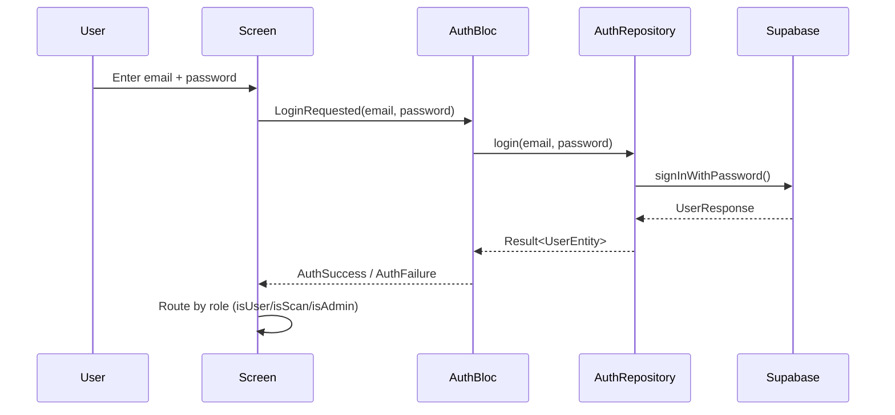
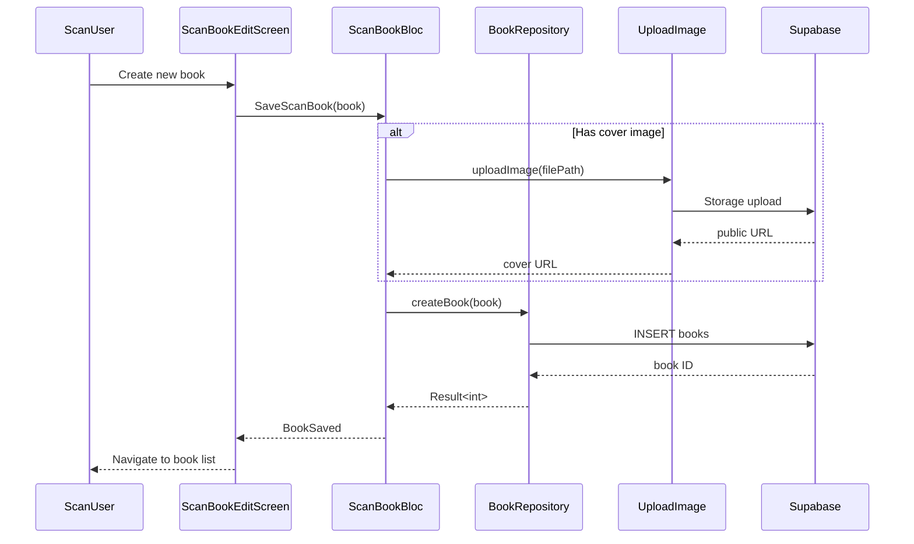
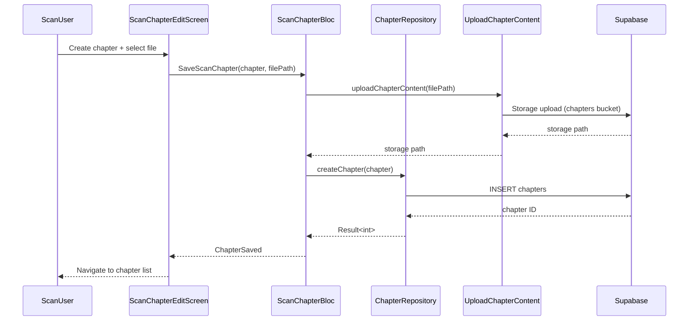

# Usuario Scan (`role = 'scan'`) — Auditoría Completa

> **Fecha de auditoría**: 2026-07-19
> **Versión del proyecto**: Noveles (Flutter + Supabase)

---

## Tabla de Contenidos

1. [Definición y Modelo](#1-definición-y-modelo)
2. [Flujo de Autenticación](#2-flujo-de-autenticación)
3. [Pantallas y Navegación](#3-pantallas-y-navegación)
4. [Gestión de Libros (CRUD)](#4-gestión-de-libros-crud)
5. [Gestión de Capítulos](#5-gestión-de-capítulos)
6. [Gestión de Tomes (Tooks)](#6-gestión-de-tomes-tooks)
7. [Gestión de Géneros y Etiquetas](#7-gestión-de-géneros-y-etiquetas)
8. [Subida de Archivos (Covers,
   Contenido)](#8-subida-de-archivos-covers-contenido)
9. [Interacciones con Supabase (RLS)](#9-interacciones-con-supabase-rls)
10. [BLoCs y Estado](#10-blocs-y-estado)
11. [Casos de Uso (Domain Layer)](#11-casos-de-uso-domain-layer)
12. [Restricciones vs Admin/User](#12-restricciones-vs-adminuser)
13. [Archivos Relacionados (lista
    completa)](#13-archivos-relacionados-lista-completa)

---

## 1. Definición y Modelo

### 1.1 UserEntity

**Archivo**: `lib/features/profiles/domain/user_entity.dart` (53 líneas)

```dart
class UserEntity extends Equatable {
  final String id;       // UUID de Supabase Auth
  final String email;
  final UserRole role;   // UserRole enum: user, scan, admin, suspended
  final String? displayName;
  final String? bio;
  final String? avatarUrl;

  bool get isScan => role == UserRole.scan;       // Línea 21
  bool get isAdmin => role == UserRole.admin;     // Línea 22
  bool get isUser => role == UserRole.user;       // Línea 23
  bool get isSuspended => role == UserRole.suspended; // Línea 24
}
```

**Getters de rol**:

- `isScan` → `role == UserRole.scan` (L21)
- `isAdmin` → `role == UserRole.admin` (L22)
- `isUser` → `role == UserRole.user` (L23)
- `isSuspended` → `role == UserRole.suspended` (L24)

### 1.2 UserModel

**Archivo**: `lib/features/profiles/data/user_model.dart` (39 líneas)

```dart
factory UserModel.fromJson(Map<String, dynamic> json) => UserModel(
  id: json['id'] as String,
  email: (json['email'] as String?) ?? '',
  role: UserRole.fromString(json['role'] as String?),  // Default: UserRole.user
  displayName: json['display_name'] as String?,
  bio: json['bio'] as String?,
  avatarUrl: json['avatar_url'] as String?,
);
```

**Nota**: El `role` se mapea desde `profiles` (no de `auth.users`) usando
`UserRole.fromString()`. El default es `UserRole.user`.

### 1.3 Roles en Supabase

**Tabla `profiles`** — CHECK constraint (migración final):

```sql
CHECK (role IN ('user', 'scan', 'admin', 'suspended'))
```

**Función helper `is_scan()`** (migración `20260520000000`):

```sql
CREATE OR REPLACE FUNCTION public.is_scan()
RETURNS BOOLEAN
LANGUAGE sql SECURITY DEFINER SET search_path = ''
STABLE
AS $$
  SELECT EXISTS (
    SELECT 1 FROM public.profiles
    WHERE id = auth.uid() AND role = 'scan'
  );
$$;
```

**Trigger auto-create**: Cada usuario nuevo recibe `role = 'user'` por defecto
al registrarse. Un admin debe promoverlo a `'scan'` manualmente.

---

## 2. Flujo de Autenticación

### 2.1 AuthBloc

**Archivo**: `lib/features/auth/presentation/bloc/auth_bloc.dart` (115 líneas)

El flujo de auth es idéntico para todos los roles:

1. **`CheckAuthSession`** → llama `getCurrentUser()` → emite
   `AuthAuthenticated(user)` si hay sesión
2. **`LoginRequested`** → llama `login(email, password)` → emite
   `AuthAuthenticated(user)`
3. **`RegisterRequested`** → llama `register(email, password)` → emite
   `AuthAuthenticated(user)`
4. **`LogoutRequested`** → llama `logout()` → emite `AuthUnauthenticated()`

#### Diagrama de Secuencia — Flujo de Login



### 2.2 Routing por Rol (CRÍTICO)

**Archivo**: `lib/core/app/app.dart` (73 líneas), líneas 54-62:

```dart
if (authState is AuthAuthenticated) {
  if (authState.user.isAdmin) {
    return const AdminDashScreen();      // ← Admin ve dashboard admin
  }
  if (authState.user.isScan) {
    return const ScanMainScreen();       // ← Scan ve panel scan
  }
  return const MainScreen();             // ← User ve home de lectura
}
```

**Prioridad**: Admin primero → Scan segundo → User tercero.

**Implicación**: Un usuario con `role = 'scan'` NUNCA ve `MainScreen` (la
pantalla de lectura para usuarios regulares). El scan solo ve su panel de
contenido.

---

## 3. Pantallas y Navegación

### 3.1 ScanMainScreen — Pantalla Principal del Scan

**Archivo**: `lib/features/scan/presentation/screens/scan_main_screen.dart`
(255
líneas)

**Componentes**:

- `AppBar`: título "Panel Scan"
- `Drawer`: `AppDrawer(isScan: true)`
- `Body`: Lista de libros (RefreshIndicator + ListView.builder)
- `FAB`: "+" para crear libro nuevo

**Lo que ve el scan en esta pantalla**:

- Lista de libros que **él creó** (RLS: `created_by = auth.uid()`)
- Para cada libro:
  - Cover thumbnail (CachedNetworkImage)
  - Nombre del libro
  - Subtítulo: `ID: {id} - {tookCount} tomos`
  - **Switch de visibilidad** (`isVisible`) — puede ocultar/mostrar su novela
    para usuarios
  - **Botón Editar** → navega a `ScanBookEditScreen`
  - **Botón Eliminar** → dialog de confirmación → `DeleteScanBook`
  - **Tap** en el libro → navega a `ScanBookEditScreen`

### 3.2 ScanBookEditScreen — Editor de Libro

**Archivo**:
`lib/features/scan/presentation/screens/scan_book_edit_screen.dart`
(463 líneas)

**Campos del formulario**:

| Campo | Tipo | Validación |
| ----- | ---- | ---------- |
| Nombre | TextFormField | **Requerido** |
| Cover | CoverPicker (image) | Opcional |
| Nombre corto | TextFormField | Opcional |
| Nombre alternativo | TextFormField | Opcional |
| Descripción | TextFormField (multiline) | Opcional |
| Autor | TextFormField | Opcional |
| País | TextFormField | Opcional |
| Estado | DropdownButtonFormField | Opcional (Emisión/Finalizad... |
| Tipo | DropdownButtonFormField | Opcional (Web Novel/Light Novel) |
| Lanzamiento | TextFormField | Opcional |
| Fuente | TextFormField | Opcional |
| Link | TextFormField | Opcional |
| Géneros | GenreSelector (FilterChip) | Opcional, múltiple |
| Tomos | TookListSection | Solo en modo edición |

**Comportamiento**:

- **Crear**: Crea libro → recarga lista → captura el ID real de la DB → permite
  agregar tomos
- **Editar**: Actualiza libro → recarga lista
- **Agregar tomo**: Si el libro es nuevo, lo guarda primero → navega a
  `ScanTookEditScreen`
- **Guardar**: `_save()` → `_saveBook()` → `SaveScanBook` event → espera
  resultado con Completer (timeout 10s)

**FAB**: Solo visible en modo edición → agregar tomo

### 3.3 ScanTookEditScreen — Editor de Tomo

**Archivo**:
`lib/features/scan/presentation/screens/scan_took_edit_screen.dart`
(343 líneas)

**Campos**:

| Campo | Tipo | Validación |
| ----- | ---- | ---------- |
| Número | TextFormField | **Requerido** |
| Título | TextFormField | Opcional |
| Cover | CoverPicker (image) | Opcional |

**Comportamiento**:

- **Crear/Actualizar tomo**: `SaveScanTook` event
- **Cover upload**: `UploadTookCover` → `ImagePicker` (galería) →
  `ScanTookBloc`
- **Listado de capítulos**: Solo visible en modo edición
  - Cada capítulo muestra: título o "Cap. {number}", ID
  - **Editar capítulo** → `ScanChapterEditScreen`
  - **Eliminar capítulo** → `DeleteScanChapter`
- **FAB**: Agregar capítulo (solo en modo edición)

**Cadena de dependencias**: Capítulos dependen de tomos → tomos dependen de
libros.

### 3.4 ScanChapterEditScreen — Editor de Capítulo

**Archivo**:
`lib/features/scan/presentation/screens/scan_chapter_edit_screen.dart` (293
líneas)

**Campos**:

| Campo | Tipo | Validación |
| ----- | ---- | ---------- |
| Número | TextFormField | **Requerido** |
| Título | TextFormField | Opcional |
| Archivo de contenido | FilePicker (.md, .txt) | Opcional |

**Comportamiento de upload**:

1. Usuario selecciona archivo `.md` o `.txt` via `FilePicker`
2. Se emite `UploadChapterFile` → `ScanChapterBloc`
3. El archivo se sube al bucket `chapters` de Supabase Storage
4. Se recibe la URL pública → se guarda en `_contentCtrl.text`
5. Al guardar, la URL se envía como campo `content` del capítulo

**Si ya hay contenido**: Muestra card con nombre del archivo + botón
"Reemplazar"

### 3.5 Widgets Reutilizables

#### CoverPicker

**Archivo**: `lib/features/scan/presentation/screens/widgets/cover_picker.dart`
(83 líneas)

- Muestra preview de imagen si `controller.text` no está vacío
- Botón "Seleccionar imagen" → llama `onPick`
- Botón "Quitar" → llama `onClear`
- Muestra la URL/filename del cover

#### GenreSelector

**Archivo**:
`lib/features/scan/presentation/screens/widgets/genre_selector.dart` (59
líneas)

- Renderiza géneros como `FilterChip` en un `Wrap`
- Permite selección múltiple
- Carga géneros desde `ScanBookBloc` via `LoadScanGenres`

#### TookListSection

**Archivo**:
`lib/features/scan/presentation/screens/widgets/took_list_section.dart` (84
líneas)

- Lista de tomos con botones editar/eliminar
- Solo visible cuando `isEditing = true`
- Muestra cantidad de capítulos por tomo

### 3.6 AppDrawer — Menú Lateral

**Archivo**: `lib/features/app/presentation/widgets/app_drawer.dart` (129
líneas)

**Para scan** (`isScan: true`, `isAdmin: false`):

```text
┌─────────────────────────┐
│  Avatar + Nombre        │
│  Email                  │
├─────────────────────────┤
│  ⚙ Panel Scan          │  ← solo cierra el drawer (ya está en panel scan)
│  👤 Editar Perfil       │
├─────────────────────────┤
│  🚪 Cerrar Sesión       │
└─────────────────────────┘
```

**No tiene** acceso a:

- "Panel Admin" (solo visible si `isAdmin = true`)
- Navegación a home de lectura

---

## 4. Gestión de Libros (CRUD)

### 4.1 Flujo Completo

```text
ScanMainScreen
  │
  ├── FAB (+) ──→ ScanBookEditScreen(nuevo)
  │                 ├── Guarda libro → ScanBloc → CreateBook → BookRepository
  │                 ├── Sube cover → ScanBloc → UploadCover → Supabase Storage "covers"
  │                 ├── Selecciona géneros → ScanBloc → LoadScanGenres
  │                 └── Agrega tomo → ScanTookEditScreen
  │
  ├── Tap libro ──→ ScanBookEditScreen(existente)
  │                 ├── Edita campos → UpdateBook → BookRepository
  │                 ├── Edita cover → UploadCover
  │                 ├── Edita géneros → books_genres (delete + insert)
  │                 ├── Edita tomos → ScanTookEditScreen
  │                 └── Elimina tomo → DeleteTook → TookRepository
  │
  ├── Switch visibilidad ──→ ToggleScanBookVisibility
  │                           └── books.update({ is_visible: value })
  │
  └── Botón eliminar ──→ DeleteScanBook
                          └── books.delete().eq('id', id)
```

#### Diagrama de Secuencia — Creación de Libro



### 4.2 Operaciones Supabase (Books)

| Operación | Tabla | SQL | RLS Policy |
| --------- | ----- | --- | ---------- |
| SELECT | books | select('*,authors(*),b... | "..." (is_scan, owner) |
| INSERT | books | insert({...}) | "..." (is_scan, owner) |
| UPDATE | books | update({...}).eq('id',id) | "..." (is_scan, owner) |
| DELETE | books | delete().eq('id',id) | "..." (is_scan, owner) |
| INSERT | authors | insert({'name': author}) | "..." (generic) |
| SELECT | authors | select('id').eq('name'... | "..." (all) |
| INSERT | books_genres | insert([...]) | "..." (generic) |
| DELETE | books_genres | delete().eq('book_id',id) | "..." (generic) |
| INSERT | books_labels | insert([...]) | "Enable insert for scan and admin" |
| DELETE | books_labels | delete().eq('book_id',id) | "..." |

### 4.3 Campos del BookEntity

```dart
BookEntity({
  id,                    // int (DateTime.now().millisecondsSinceEpoch para nuevos)
  createdAt,             // DateTime
  cover,                 // String (filename en Storage)
  name,                  // String (requerido)
  short,                 // String (nombre corto)
  alternative,           // String (nombre alternativo)
  description,           // String
  authorId,              // int (auto-creado si author existe)
  author,                // String (nombre del autor)
  country,               // String
  state,                 // String ('Emisión'|'Finalizado'|'Pausado'|'Abandonado')
  type,                  // String ('Web'|'Ligera')
  release,               // String
  tookCount,             // int
  chapterCount,          // int
  source,                // String
  link,                  // String
  isFavorite,            // bool (default false)
  isVisible,             // bool (default false)
  listGenreIds,          // List<int>
  listTookIds,           // List<int>
  listLabelIds,          // List<int>
  createdBy,             // String? (UUID del usuario que creó)
})
```

### 4.4 Auto-creación de Author

En `BookRepositoryImpl.createBook()` (L62-84):

1. Si `authorId == 0` y `author` no está vacío
2. Busca author existente por nombre
3. Si no existe, lo crea
4. Usa el `authorId` resultante para el libro

---

## 5. Gestión de Capítulos

### 5.1 ScanChapterBloc

**Archivo**: `lib/features/scan/presentation/bloc/scan_chapter_bloc.dart` (61
líneas)

**4 casos de uso inyectados**:

- `CreateChapter` → `ChapterRepository.createChapter()`
- `UpdateChapter` → `ChapterRepository.updateChapter()`
- `DeleteChapter` → `ChapterRepository.deleteChapter()`
- `UploadChapterContent` → `ChapterRepository.uploadContent()`

**3 eventos**:

| Evento | Acción | Estado resultante |
| ------ | ------ | ----------------- |
| SaveScanChapter(ch,isUpdate) | Create o Update | ScanChapterLoaded(msg) |
| DeleteScanChapter(chId) | Delete | ScanChapterLoaded(msg) |
| UploadChapterFile(path) | Upload a Storage | ScanChapterContentUploaded(url) |

**5 estados**:

| Estado | Datos |
| ------ | ----- |
| `ScanChapterInitial` | — |
| `ScanChapterLoading` | — |
| `ScanChapterLoaded` | `message?` |
| `ScanChapterError` | `message` |
| `ScanChapterContentUploaded` | `url`, `fileName` |

### 5.2 Flujo de Upload de Contenido

```text
ScanChapterEditScreen
  │
  ├── FilePicker.pickFiles(allowedExtensions: ['md', 'txt'])
  │
  ├── ScanChapterBloc.add(UploadChapterFile(filePath))
  │     │
  │     └── ChapterRepository.uploadContent(filePath)
  │           │
  │           ├── Lee el archivo local
  │           ├── Genera filename: "{timestamp}.{ext}"
  │           ├── storage.from('chapters').upload(filename, file)
  │           └── storage.from('chapters').getPublicUrl(filename)
  │
  └── _contentCtrl.text = publicUrl
```

#### Diagrama de Secuencia — Subida de Capítulo



### 5.3 Operaciones Supabase (Chapters)

| Operación | Tabla | RLS Policy |
| --------- | ----- | ---------- |
| SELECT | `chapters` | "Enable read for all users" (`true`) |
| INSERT | chapters | "Enable insert for scan onl... |
| UPDATE | chapters | "Enable update for scan onl... |
| DELETE | chapters | "Enable delete for scan onl... |

**⚠️ Hallazgo de seguridad**: Las políticas de capítulos NO verifican
`created_by = auth.uid()`. Un usuario scan puede modificar/eliminar capítulos
de OTROS usuarios scan, a diferencia de los libros que sí tienen ownership
check.

### 5.4 ChapterEntity

```dart
ChapterEntity({
  id,         // int
  createdAt,  // DateTime
  number,     // String
  title,      // String
  content,    // String (URL pública de Supabase Storage o contenido inline)
  tookId,     // int (FK al tomo padre)
  createdBy,  // String? (UUID)
})
```

---

## 6. Gestión de Tomes (Tooks)

### 6.1 ScanTookBloc

**Archivo**: `lib/features/scan/presentation/bloc/scan_took_bloc.dart` (61
líneas)

**4 casos de uso inyectados**:

- `CreateTook` → `TookRepository.createTook()`
- `UpdateTook` → `TookRepository.updateTook()`
- `DeleteTook` → `TookRepository.deleteTook()`
- `UploadCover` → `BookRepository.uploadCover()` (reutiliza el mismo de libros)

**3 eventos**:

| Evento | Acción | Estado resultante |
| ------ | ------ | ----------------- |
| `SaveScanTook(took,isUpdate)` | Create o Update | `ScanTookLoaded(message)` |
| `DeleteScanTook(tookId)` | Delete | `ScanTookLoaded(message)` |
| UploadTookCover(path) | Upload cover a Storage | ScanTookCoverUploaded(url) |

**5 estados**:

| Estado | Datos |
| ------ | ----- |
| `ScanTookInitial` | — |
| `ScanTookLoading` | — |
| `ScanTookLoaded` | `message?` |
| `ScanTookError` | `message` |
| `ScanTookCoverUploaded` | `url` |

### 6.2 Operaciones Supabase (Tooks)

| Operación | Tabla | RLS Policy |
| --------- | ----- | ---------- |
| SELECT | `tooks` | "Enable read for all users" (`true`) |
| INSERT | tooks | "Enable insert for scan onl... |
| UPDATE | tooks | "Enable update for scan onl... |
| DELETE | tooks | "Enable delete for scan onl... |

**⚠️ Hallazgo de seguridad**: Similar a capítulos, los tomos NO tienen ownership
check en RLS. Un scan puede modificar tomos de otro scan.

### 6.3 TookEntity

```dart
TookEntity({
  id,                // int
  createdAt,         // DateTime
  cover,             // String (filename en Storage)
  number,            // String
  title,             // String
  chapterCount,      // int
  bookId,            // int (FK al libro padre)
  listChapterIds,    // List<int>
  createdBy,         // String? (UUID)
})
```

---

## 7. Gestión de Géneros y Etiquetas

### 7.1 Géneros — Solo Lectura para Scan

El scan interactúa con géneros de **lectura sola**:

- `LoadScanGenres` en `ScanBookBloc` → llama `GetGenre()` →
  `GenreRepository.getGenres()`
- Los géneros se cargan al abrir `ScanBookEditScreen` (L68)
- Se renderizan como `FilterChip` en `GenreSelector`
- El scan **selecciona** géneros existentes para asociarlos a su libro
- **NO puede crear, editar ni eliminar géneros** — eso es exclusivo del admin
- **RLS de géneros**:

- SELECT: `"Enable read for all users"` (`true`) — todos leen
- INSERT/UPDATE/DELETE: `"Enable insert/update/delete for admin only"`
  (`is_admin()`) — solo admin escribe

### 7.2 Etiquetas (Labels) — Lectura y Asociación

El scan puede:

- **Leer etiquetas**: RLS `"Enable read for all users"` (`true`)
- **Crear/Editar/Eliminar etiquetas**: RLS `"Enable insert/update/delete for
  scan and admin"` (`is_scan() OR is_admin()`)
- **Asociar etiquetas a libros**: Via `books_labels` — INSERT/DELETE permitido
  para scan y admin

**⚠️ Hallazgo**: En el UI del scan, NO hay pantalla dedicada para crear/editar
etiquetas. La ruta `/label-management` existe en `app.dart` (L32) pero no es
accesible desde el drawer del scan. Las etiquetas se gestionan desde el admin
(panel admin o ruta directa).

---

## 8. Subida de Archivos (Covers, Contenido)

### 8.1 Buckets de Supabase Storage

**Archivo**: `lib/core/constants/storage_constants.dart`

```dart
class StorageConstants {
  static const String coversBucket = 'covers';
  static const String chaptersBucket = 'chapters';
}
```

### 8.2 Cover Upload Flow

**Caso de uso**: `UploadCover` → `BookRepository.uploadCover()`

```text
ImagePicker.pickImage(source: ImageSource.gallery)
  │
  ├── Validación de tamaño: máximo 5MB (L197-210 de book_repository_impl.dart)
  ├── Validación de extensión: jpg, jpeg, png, webp
  ├── Filename: "{timestamp}.{ext}"
  ├── storage.from('covers').upload(filename, file)
  └── Retorna filename (no URL completa)
```

**Covers bucket RLS** (consolidado):

| Política | Operación | Condición |
| -------- | --------- | --------- |
| "Covers public read" | SELECT | `bucket_id = 'covers'` |
| "Covers authenticated insert" | INSERT | bucket_id = 'covers' AND au... |
| "Covers authenticated update" | UPDATE | bucket_id = 'covers' AND au... |
| "Covers authenticated delete" | DELETE | bucket_id = 'covers' AND au... |
| "Covers service_role all" | ALL | bucket_id = 'covers' AND au... |

**Resultado**: Cualquier usuario autenticado (scan, admin, user) puede
subir/modificar/eliminar covers.

### 8.3 Chapter Content Upload Flow

**Caso de uso**: `UploadChapterContent` → `ChapterRepository.uploadContent()`

```text
FilePicker.pickFiles(type: FileType.custom, allowedExtensions: ['md', 'txt'])
  │
  ├── Filename: "{timestamp}.{ext}"
  ├── storage.from('chapters').upload(filename, file)
  ├── storage.from('chapters').getPublicUrl(filename)
  └── Retorna URL pública completa
```

**Chapters bucket RLS** (consolidado):

| Política | Operación | Condición |
| -------- | --------- | --------- |
| "Chapters public read" | SELECT | `bucket_id = 'chapters'` |
| "Chapters authenticated insert" | INSERT | bucket_id = 'chapters' AND ... |
| "Chapters authenticated update" | UPDATE | bucket_id = 'chapters' AND ... |
| "Chapters authenticated delete" | DELETE | bucket_id = 'chapters' AND ... |
| "Chapters authenticated all" | ALL | bucket_id = 'chapters' AND ... |
| "Chapters service_role all" | ALL | bucket_id = 'chapters' AND ... |

**Resultado**: Cualquier usuario autenticado puede subir contenido de
capítulos.

### 8.4 CoverUrlService

**Archivo**: `lib/core/cover/cover_url_service.dart` (14 líneas)

```dart
String call(String? cover) {
  if (cover == null || cover.isEmpty) return '';
  if (cover.startsWith('http')) return cover;  // URL externa
  return _supabase.storage.from('covers').getPublicUrl(cover);  // Filename local
}
```

Se usa en: `scan_main_screen.dart` (L133), `cover_picker.dart` (L38),
`app_drawer.dart` (L38)

---

## 9. Interacciones con Supabase (RLS)

### 9.1 Resumen de Políticas Activas para Scan

#### Tabla `books`

| Política | Operación | Condición Final |
| -------- | --------- | --------------- |
| "Scan can read all books" | SELECT | is_scan() AND created_by = auth.uid() |
| "Users can read visible books" | SELECT | is_visible = true AND NOT i... |
| "Enable insert for scan only" | INSERT | is_scan() AND created_by = ... |
| "Enable update for scan only" | UPDATE | is_scan() AND created_by = ... |
| "Enable delete for scan only" | DELETE | is_scan() AND created_by = ... |
| "Enable insert for admin only" | INSERT | `is_admin()` |
| "Enable update for admin only" | UPDATE | `is_admin()` |
| "Enable delete for admin only" | DELETE | `is_admin()` |

**Conclusión**: El scan solo puede leer/escribir libros que **él mismo creó**.

#### Tabla `tooks`

| Política | Operación | Condición Final |
| -------- | --------- | --------------- |
| "Enable read for all users" | SELECT | `true` |
| "Enable insert for scan only" | INSERT | `is_scan()` — **sin ownership** |
| "Enable update for scan only" | UPDATE | `is_scan()` — **sin ownership** |
| "Enable delete for scan only" | DELETE | `is_scan()` — **sin ownership** |
| "Enable insert for admin only" | INSERT | `is_admin()` |
| "Enable update for admin only" | UPDATE | `is_admin()` |
| "Enable delete for admin only" | DELETE | `is_admin()` |

#### Tabla `chapters`

| Política | Operación | Condición Final |
| -------- | --------- | --------------- |
| "Enable read for all users" | SELECT | `true` |
| "Enable insert for scan only" | INSERT | `is_scan()` — **sin ownership** |
| "Enable update for scan only" | UPDATE | `is_scan()` — **sin ownership** |
| "Enable delete for scan only" | DELETE | `is_scan()` — **sin ownership** |
| "Enable insert for admin only" | INSERT | `is_admin()` |
| "Enable update for admin only" | UPDATE | `is_admin()` |
| "Enable delete for admin only" | DELETE | `is_admin()` |

#### Tabla `genres`

| Política | Operación | Condición Final |
| -------- | --------- | --------------- |
| "Enable read for all users" | SELECT | `true` |
| "Enable insert for admin only" | INSERT | `is_admin()` |
| "Enable update for admin only" | UPDATE | `is_admin()` |
| "Enable delete for admin only" | DELETE | `is_admin()` |

## Scan: solo lectura

### Tabla `labels`

| Política | Operación | Condición Final |
| -------- | --------- | --------------- |
| "Enable read for all users" | SELECT | `true` |
| "Enable insert for scan and admin" | INSERT | `is_scan() OR is_admin()` |
| "Enable update for scan and admin" | UPDATE | `is_scan() OR is_admin()` |
| "Enable delete for scan and admin" | DELETE | `is_scan() OR is_admin()` |

## Scan: CRUD completo en labels

### Tabla `books_genres`

| Política | Operación | Condición Final |
| -------- | --------- | --------------- |
| "Enable read for all users" | SELECT | `true` |
| "Enable insert for scan only" | INSERT | `is_scan()` |
| "Enable delete for scan only" | DELETE | `is_scan()` |
| "Enable insert for admin only" | INSERT | `is_admin()` |
| "Enable update for admin only" | UPDATE | `is_admin()` |
| "Enable delete for admin only" | DELETE | `is_admin()` |

#### Tabla `books_labels`

| Política | Operación | Condición Final |
| -------- | --------- | --------------- |
| "Enable read for all users" | SELECT | `true` |
| "Enable insert for scan and admin" | INSERT | `is_scan() OR is_admin()` |
| "Enable delete for scan and admin" | DELETE | `is_scan() OR is_admin()` |

#### Tabla `authors`

| Política | Operación | Condición Final |
| -------- | --------- | --------------- |
| "Enable read for all users" | SELECT | `true` |
| "Enable insert for scan only" | INSERT | `is_scan()` |
| "Enable update for scan only" | UPDATE | `is_scan()` |
| "Enable delete for scan only" | DELETE | `is_scan()` |

#### Tabla `profiles`

| Política | Operación | Condición Final |
| -------- | --------- | --------------- |
| "Users can read own profile" | SELECT | `auth.uid() = id` |
| "Scan can read all profiles" | SELECT | `is_scan()` |
| "Admin can read all profiles" | SELECT | `is_admin()` |
| "Users can insert own profile" | INSERT | `auth.uid() = id` |
| "Users can update own profile" | UPDATE | `auth.uid() = id` |
| "Admin can update profiles" | UPDATE | `is_admin()` |

## Scan puede ver todos los profiles

### Tabla `book_views`

| Política | Operación | Condición Final |
| ----------------------------- | ----------- | --------------- |
| "Admin can insert book views" | INSERT | `is_admin()` |
| "Admin can read book views" | SELECT | `is_admin()` |

## Scan: sin acceso a analytics

### Storage (`storage.objects`)

| Bucket | Operación | Scan puede |
| ------ | --------- | ---------- |
| `covers` | SELECT | ✅ (lectura pública) |
| `covers` | INSERT | ✅ (autenticado) |
| `covers` | UPDATE | ✅ (autenticado) |
| `covers` | DELETE | ✅ (autenticado) |
| `chapters` | SELECT | ✅ (lectura pública) |
| `chapters` | INSERT | ✅ (autenticado) |
| `chapters` | UPDATE | ✅ (autenticado) |
| `chapters` | DELETE | ✅ (autenticado) |
| `avatars` | SELECT | ✅ (lectura pública) |
| `avatars` | INSERT | ✅ (autenticado, carpeta propia) |
| `avatars` | UPDATE | ✅ (autenticado, carpeta propia) |

---

## 10. BLoCs y Estado

### 10.1 ScanBookBloc (Libros + Géneros + Visibilidad)

**Archivo**: `lib/features/scan/presentation/bloc/scan_book_bloc.dart`

**Nota**: Originalmente existía un `ScanBloc` monolítico que manejaba libros,
covers, géneros y visibilidad. Fue dividido en BLoCs separados:
`ScanBookBloc`, `ScanCoverBloc`, `ScanTookBloc`, `ScanChapterBloc`.

**5 casos de uso**:

| Caso de uso | Tipo | Descripción |
| ----------- | ---- | ----------- |
| `GetBooks` | Lectura | Lista todos los libros del scan (own) |
| `CreateBook` | Escritura | Crea libro nuevo |
| `UpdateBook` | Escritura | Actualiza libro existente |
| `DeleteBook` | Escritura | Elimina libro |
| `GetGenre` | Lectura | Lista todos los géneros disponibles |
| `ToggleBookVisibility` | Escritura | Cambia is_visible del libro |

**Eventos**:

1. `LoadScanBooks` → carga libros
2. `LoadScanGenres` → carga géneros
3. `SaveScanBook(book, isUpdate)` → crea o actualiza libro
4. `DeleteScanBook(bookId)` → elimina libro
5. `ToggleScanBookVisibility(bookId, isVisible)` → toggle visibilidad

**Estados**:

1. `ScanInitial`
2. `ScanLoading`
3. `ScanLoaded(books, message?)`
4. `ScanGenresLoaded(books, genres)`
5. `ScanError(message)`

### 10.1b ScanCoverBloc (Covers)

**Archivo**: `lib/features/scan/presentation/bloc/scan_cover_bloc.dart`

Maneja la subida de covers para libros y tomos.

| Caso de uso | Tipo |
| ----------- | ---- |
| `UploadCover` | Escritura |

### 10.2 ScanTookBloc (Tomos)

**Archivo**: `lib/features/scan/presentation/bloc/scan_took_bloc.dart` (61
líneas)

**4 casos de uso**:

| Caso de uso | Tipo |
| ----------- | ---- |
| `CreateTook` | Escritura |
| `UpdateTook` | Escritura |
| `DeleteTook` | Escritura |
| `UploadCover` | Escritura (reutiliza el de libros) |

### 10.3 ScanChapterBloc (Capítulos)

**Archivo**: `lib/features/scan/presentation/bloc/scan_chapter_bloc.dart` (61
líneas)

**4 casos de uso**:

| Caso de uso | Tipo |
| ----------- | ---- |
| `CreateChapter` | Escritura |
| `UpdateChapter` | Escritura |
| `DeleteChapter` | Escritura |
| `UploadChapterContent` | Escritura |

---

## 11. Casos de Uso (Domain Layer)

### 11.1 Book Domain

**Directorio**: `lib/features/books/domain/`

| Caso de uso | Archivo | Usado por scan |
| ----------- | ------- | -------------- |
| `GetBooks` | `get_book.dart` | ✅ (LoadScanBooks) |
| `GetBookById` | `get_book_by_id.dart` | ❌ |
| `GetBooksByGenre` | `get_books_by_genre.dart` | ❌ |
| `GetBookLabels` | `get_book_labels.dart` | ❌ |
| `CreateBook` | `create_book.dart` | ✅ (SaveScanBook) |
| `UpdateBook` | `update_book.dart` | ✅ (SaveScanBook) |
| `DeleteBook` | `delete_book.dart` | ✅ (DeleteScanBook) |
| `UploadCover` | `upload_cover.dart` | ✅ (UploadScanCover, UploadTookCover) |
| ToggleBookVisibility | toggle_book_visibility.dart | ✅ (ToggleScanBookVis) |

### 11.2 Chapter Domain

**Directorio**: `lib/features/chapters/domain/`

| Caso de uso | Archivo | Usado por scan |
| ----------- | ------- | -------------- |
| `GetChapters` | `get_chapter.dart` | ❌ |
| `GetChapterById` | `get_chapter_by_id.dart` | ❌ |
| `GetChapterContent` | `get_chapter_content.dart` | ❌ |
| `CreateChapter` | `create_chapter.dart` | ✅ (SaveScanChapter) |
| `UpdateChapter` | `update_chapter.dart` | ✅ (SaveScanChapter) |
| `DeleteChapter` | `delete_chapter.dart` | ✅ (DeleteScanChapter) |
| UploadChapterContent | upload_chapter_content.dart | ✅ (UploadChapterFile) |

### 11.3 Took Domain

**Directorio**: `lib/features/tooks/domain/`

| Caso de uso | Archivo | Usado por scan |
| ----------- | ------- | -------------- |
| `GetTooks` | `get_took.dart` | ❌ |
| `GetTookById` | `get_took_by_id.dart` | ❌ |
| `GetTooksByBook` | `get_tooks_by_book.dart` | ❌ |
| `CreateTook` | `create_took.dart` | ✅ (SaveScanTook) |
| `UpdateTook` | `update_took.dart` | ✅ (SaveScanTook) |
| `DeleteTook` | `delete_took.dart` | ✅ (DeleteScanTook) |

**Nota**: Los tomos se cargan como parte del join de `getBooks()` → `tooks(*,
chapters(*))`, no vía casos de uso dedicados.

---

## 12. Restricciones vs Admin/User

### 12.1 Scan vs Admin

| Capacidades | Scan | Admin |
| ----------- | ---- | ----- |
| Pantalla principal | ScanMainScreen | AdminDashScreen |
| **Ver libros** | Solo propios (`created_by = auth.uid()`) | Todos |
| **Crear/Eliminar libros** | ✅ (propios) | ✅ (todos) |
| **Toggle visibilidad** | ✅ (propios) | ✅ (todos) |
| **Crear/Eliminar géneros** | ❌ | ✅ |
| **Gestionar usuarios** | ❌ | ✅ (UsersTab — listar, cambiar rol, suspender) |
| **Ver analíticas** | ❌ | ✅ (AnalyticsTab — placeholder) |
| **Crear/Eliminar etiquetas** | ✅ (RLS lo permite) | ✅ |
| **Gestionar labels UI** | ❌ (no hay pantalla) | ✅ (LabelManagementScreen) |
| **Ver todos los profiles** | ✅ (RLS) | ✅ |
| **Editar profiles de otros** | ❌ | ✅ (AdminCanUpdateProfiles) |
| **Acceso a book_views** | ❌ | ✅ |
| Navegación del drawer | "Panel Scan" | "Panel Admin" |

### 12.2 Scan vs User (regular)

| Capacidades | Scan | User |
| ----------- | ---- | ---- |
| Pantalla principal | ScanMainScreen | MainScreen |
| **Ver libros** | Solo propios | Solo `is_visible = true` |
| **Crear contenido** | ✅ (libros, tomos, capítulos) | ❌ |
| **Subir covers** | ✅ | ❌ (RLS lo permite pero no hay UI) |
| **Subir contenido** | ✅ (.md, .txt) | ❌ (no hay UI) |
| **Toggle visibilidad** | ✅ (propios) | ❌ |
| **Editar perfil** | ✅ | ✅ |
| **Ver géneros** | ✅ | ✅ |
| **Ver etiquetas** | ✅ | ✅ |

### 12.3 Resumen de Acciones del Scan

**✅ PUEDE hacer**:

1. Ver/editar/eliminar libros que **él creó**
2. Subir covers (libros y tomos) a Supabase Storage
3. Crear/editar/eliminar tomos
4. Crear/editar/eliminar capítulos (con upload de contenido .md/.txt)
5. Asociar/desasociar géneros a sus libros
6. Asociar/desasociar etiquetas a sus libros
7. Toggle visibilidad de sus libros
8. Ver todos los profiles
9. Editar su propio perfil
10. Crear/editar/eliminar etiquetas (RLS lo permite, pero no hay UI)

**❌ NO PUEDE hacer**:

1. Ver libros de otros scans (solo los propios)
2. Crear/editar/eliminar géneros
3. Gestionar usuarios (promover, cambiar rol, suspender) — solo admin
4. Ver analíticas (book_views)
5. Ver la pantalla de home de lectura (MainScreen)
6. Editar perfiles de otros usuarios

---

## 13. Archivos Relacionados (lista completa)

### 13.1 Feature Scan (presentation)

| Archivo | Líneas | Descripción |
| ------- | ------ | ----------- |
| `scan_book_bloc.dart` | — | BLoC de libros (split desde ScanBloc) |
| `scan_book_event.dart` | — | Eventos de libros |
| `scan_book_state.dart` | — | Estados de libros |
| `scan_cover_bloc.dart` | — | BLoC de covers (split desde ScanBloc) |
| `scan_cover_event.dart` | — | Eventos de covers |
| `scan_cover_state.dart` | — | Estados de covers |
| `scan_chapter_bloc.dart` | 61 | BLoC de capítulos |
| `scan_chapter_event.dart` | 30 | 3 eventos de capítulo |
| `scan_chapter_state.dart` | 32 | 5 estados de capítulo |
| `scan_took_bloc.dart` | 61 | BLoC de tomos |
| `scan_took_event.dart` | 30 | 3 eventos de tomo |
| `scan_took_state.dart` | 31 | 5 estados de tomo |
| `scan_main_screen.dart` | 255 | Pantalla principal del scan |
| `scan_book_edit_screen.dart` | 463 | Editor de libro |
| `scan_chapter_edit_screen.dart` | 293 | Editor de capítulo |
| `scan_took_edit_screen.dart` | 343 | Editor de tomo |
| `cover_picker.dart` | 83 | Widget de selección de cover |
| `genre_selector.dart` | 59 | Widget de selección de géneros |
| `took_list_section.dart` | 84 | Widget de lista de tomos |

### 13.2 Domain Layer (use cases)

| Archivo | Líneas | Usado por scan |
| ------- | ------ | -------------- |
| `lib/features/books/domain/create_book.dart` | 13 | ✅ |
| `lib/features/books/domain/update_book.dart` | 13 | ✅ |
| `lib/features/books/domain/delete_book.dart` | 12 | ✅ |
| `lib/features/books/domain/get_book.dart` | 13 | ✅ |
| `lib/features/books/domain/upload_cover.dart` | 12 | ✅ |
| `lib/features/books/domain/toggle_book_visibility.dart` | 12 | ✅ |
| `lib/features/chapters/domain/create_chapter.dart` | 13 | ✅ |
| `lib/features/chapters/domain/update_chapter.dart` | 13 | ✅ |
| `lib/features/chapters/domain/delete_chapter.dart` | 12 | ✅ |
| `lib/features/chapters/domain/upload_chapter_content.dart` | 12 | ✅ |
| `lib/features/tooks/domain/create_took.dart` | 13 | ✅ |
| `lib/features/tooks/domain/update_took.dart` | 13 | ✅ |
| `lib/features/tooks/domain/delete_took.dart` | 12 | ✅ |

### 13.3 Data Layer (repositories + models)

| Archivo | Líneas | Descripción |
| ------- | ------ | ----------- |
| `book_repository_impl.dart` | 251 | CRUD + cover upload + labels |
| `book_model.dart` | — | Modelo de libro con relaciones |
| `chapter_repository_impl.dart` | 123 | CRUD + content upload/download |
| `lib/features/chapters/data/chapter_model.dart` | — | Modelo de capítulo |
| `lib/features/tooks/data/took_repository_impl.dart` | 105 | CRUD de tomos |
| `took_model.dart` | — | Modelo de tomo con capítulos |

### 13.4 Core / Infraestructura

| Archivo | Líneas | Descripción |
| ------- | ------ | ----------- |
| `lib/core/app/app.dart` | 73 | Routing por rol |
| `lib/core/di/injection.dart` | 36 | DI principal |
| ``scan`` | — | DI de scan (4 BLoCs: Book, Cover, Took, Chapter) |
| `lib/core/constants/storage_constants.dart` | 4 | Nombres de buckets |
| `cover_url_service.dart` | 14 | Construcción de URLs de cover |
| `app_drawer.dart` | 129 | Drawer con menú condicional |
| user_entity.dart | 53 | Entidad de usuario con isSc... |
| `user_role.dart` | 18 | UserRole enum: user, scan, admin, suspended |
| `user_model.dart` | 40 | Modelo de usuario con UserRole.fromString |
| `book_with_relations.dart` | 109 | Libro con relaciones hidratadas |
| `auth_bloc.dart` | 115 | BLoC de autenticación |

### 13.5 Migraciones Supabase (orden cronológico)

| Migración | Descripción relevante para scan |
| --------- | ------------------------------- |
| `20260514220000_initial_schema.sql` | Schema inicial |
| 20260515161849_profiles_and_auth.sql | Tabla profiles + RLS books |
| `20260515170000_profiles_extended.sql` | display_name, bio, avatar_url |
| 20260515200000_storage_migration.sql | Buckets covers/chapters |
| 20260515230000_fix_admin_consolidation.sql | Limpieza de políticas |
| 20260518010000_admin_ownership.sql | Columna created_by |
| 20260519000000_fix_tooks_chapters_rls.sql | SELECT público tooks/chapters |
| 20260520000000_rename_admin_to_scan.sql | Renombra admin→scan |
| 20260520010000_add_admin_role.sql | Agrega role 'admin' |
| `20260520020000_labels.sql` | Tabla labels + books_labels |
| 20260520171320_storage_authenticated_upload.sql | Covers auth upload |
| 20260521000000_fix_scan_rls_own_books.sql | RESTRINGE scan a propios |
| 20260522000000_audit_fixes.sql | is_admin write, indexes |
| `20260523000000_admin_panels.sql` | book_views (admin only) |
| 20260524100000_profiles_rls_insert_update.sql | Users insert own profile |
| 20260524110000_fix_books_rls_scan_visibility.sql | Fix visibility rules |
| `20260615000000_audit_fixes_v4.sql` | is_admin_or_scan, cleanup |
| 20260616000001_fix_storage_rls_security_definer.sql | Chapters storage RLS |
| 20260617153406_fix_chapters_storage_rls.sql | Chapters auth upload |
| 20260720040000_add_suspended_role.sql | Agrega rol suspended |

---

## Hallazgos Importantes

### 🔴 Seguridad

1. **Tooks y chapters sin ownership check**: Las políticas RLS de `tooks` y
   `chapters` permiten a CUALQUIER scan modificar/eliminar datos de OTROS scans.
   Solo `books` tiene `created_by = auth.uid()` check. Esto significa que un
   scan malicioso podría eliminar capítulos de otro scan.

2. **Storage sin ownership check**: Cualquier usuario autenticado puede
   subir/modificar/eliminar archivos en los buckets `covers` y `chapters`. No
   hay verificación de quién creó el archivo.

3. **Labels con doble permiso**: Scan puede crear/editar/eliminar etiquetas vía
   RLS, pero no hay UI para ello. Si se agregara, sería una funcionalidad no
   documentada.

### 🟡 Tech Debt

1. **UploadCover compartido**: `ScanTookBloc` reutiliza `UploadCover` del
   dominio de books para subir covers de tomos. Funciona pero acopla
   semanticamente tomos al bucket de covers de libros.

2. **No hay `lib/features/scan/data/`**: Todo el data layer vive en las
   features de dominio (`books/data/`, `chapters/data/`, `tooks/data/`). La
   feature scan solo tiene presentation.

3. **IDs temporales**: Books, tooks y chapters usan
   `DateTime.now().millisecondsSinceEpoch` como ID provisional. El ID real viene
   de la DB después del insert. Esto puede causar collisions si dos operaciones
   ocurren en el mismo milisegundo.

4. **No hay validación de género duplicado**: El scan puede crear un libro con
   los mismos géneros múltiples veces (la relación se borra y re-inserta en
   updateBook).

---

*Auditoría generada el 2026-07-19. Archivos verificados: 60+ archivos Dart, 20+
migraciones SQL.*
